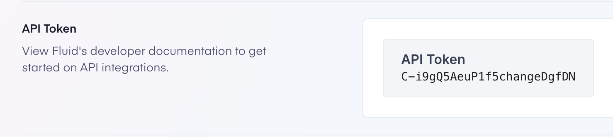

## Getting Started

### First, install dependencies:

```bash
yarn
```

### Second, set up env variables:

1. Rename file `template.env.local` to `.env.local` at the root of the project.
2. Replace the `FLUID_API_TOKEN`'s value with your api token found in the [developer settings](https://www.fluid.app/settings/developer).
3. Specify where the Fluid API is with `FLUID_BASE_URL` (no trailing slash `/`).
4. Specify the FontAwesome NPM auth token with `FONTAWESOME_NPM_AUTH_TOKEN`. (this is for icons throught the app)



Open [localhost](http://localhost:3000) in your browser to see the result.

#### This project uses [Next.js](https://nextjs.org/) and [Tailwind CSS](https://tailwindcss.com/).

You can view the documentation for those projects to understand how to customize your fork of this project.

[](https://www.heroku.com/deploy)

### Customize

#### How to create custom Product pages

You can create custom product pages in this application under the shop directory, there is another directory called `80`. This means a product with that id will get the page in that directory instead of the dynamic default product page. You can just create a new directory with the product slug of the product you want a custom page for. This is handled by Nextjs routing, and you can view that documentation [here](https://nextjs.org/docs/app/building-your-application/routing) for a better idea of how it works.

#### How does SEO meta tags work with the admin Product editor

You can set the metadata for a page by exporting a `generateMetadata` function from the page.tsx file. This function should return a Metadata object. You can read more about the Metadata object inside of Nextjs [here](https://nextjs.org/docs/app/api-reference/file-conventions/metadata).

#### How to add a Product / Variant to cart

You can look at the `shop/ProductPage.tsx` to see how we add properties to the `data-fluid-*` attributes. This is how Fluid knows which products and variants to add to the cart when clicked.

#### How to add a Product subscription to cart

Within the `data-fluid-checkout-group` element you can set an input element (probably a radio input element) with the name `data-fluid-checkout-subscribe` and the value `subscription` or `regular` and lastly the `checked` property to `truthy`. This is how we know how to add a subscription to the cart instead of a one-time product.

#### How to build a checkout from scratch

To build a checkout from scratch, you add products within fluid, and you can call fluid's APIs to get the products and variants. Then you build out your pages how you like, and follow the instructions above to add products to the cart.

#### How does attribution work on the JavaScript widget

If you look at the `layout.tsx` you can see that there is a script being loaded. This is the fluid widget that you see in the bottom right that adds chat and cart capabilities. `window.fcs = {api_url_host: '${config.apiHost}', affiliate: { share_guid: '${affiliateSlug}' }};`. The first parameter in the URL is a parameter (affiliateSlug) getting set on the widget. This is how Fluid knows who to attribute the sale to.
the affiliate object can take any keys like email ( email of the reps), external_id ( ids for those reps on external system), share_guid( unique identifier to share the pages)

#### How to set Country / Language

In the top right of the application there is a dropdown to select the country / language. This app is only written in English, it will be up to you to translate strings within the app.

#### How do my reps share a link and get credit?

In this application, just replace the first url parameter with the slug of the affiliate you want attributions to go to.
